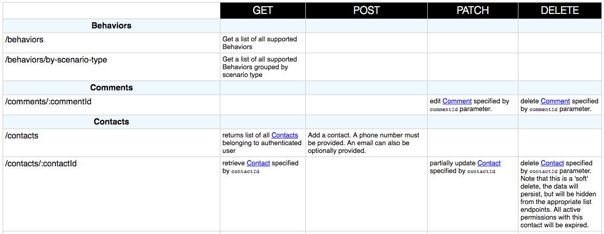

# apiDoc Summary

Generate an HTML summary page from the api_data.json file created by [apiDoc](http://apidocjs.com/). The summary
is a table with HTML methods as columns (by default: GET, POST, PATCH, DELETE) and the grouped endpoints as the rows.
Endpoint descriptions fill in the cells.




Call from Gulp like so, making sure that the apiDoc task runs first:

``` javascript

const apidocSummary = require('apidoc-summary')

...

gulp.task('apidoc-summary', ['apidoc'], function(cb){
  apidocSummary({
    src: __dirname + '/public/docs/api_data.json', //required
    dest: __dirname + '/public/docs/summary.html',  //required
    columns: ['get', 'post', 'put', 'delete'] //optional
  }, cb);
})
```

The options `src` and `dest` parameters are required. Optionally, a `columns` parameter can be passed with an array of the
HTTP methods that should be output. At least one method should be passed.

